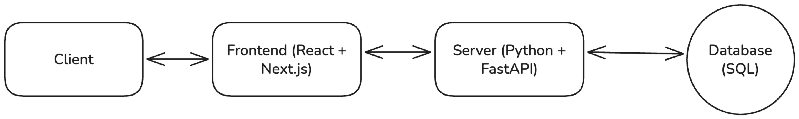

# Payments app

## Project overview

This is a mock payments system that allows users to register for trips and pay for them.

### Functional requirements

- View schools
- View school trips
- Book trips (register + payment)

### Non-functional requirements

- Trip booking is highly consistent, trip viewing is highly available
- Payment is processed using a legacy payment system

### Core entities

- Users
- Schools
- Trips
- Registrations
- Payments

### API Design

Docs / OpenAPI

- GET /docs
- GET /openapi.json

Users

- GET /users
- POST /users
- GET /users/:id
- PATCH /users/:id
- DELETE /users/:id

- GET /users/me
- PATCH /users/me
- PATCH /users/me/password
- DELETE /users/me
- POST /users/login/access-token

Schools

- GET /schools
- POST /schools
- GET /schools/:id
- PATCH /schools/:id
- DELETE /schools/:id

Trips

- GET /trips
- POST /trips
- GET /trips/:id
- PATCH /trips/:id
- DELETE /trips/:id

Registrations

- GET /registrations
- POST /registrations
- GET /registrations/me
- GET /registrations/:id
- PATCH /registrations/:id
- DELETE /registrations/:id

Payments

- POST /payments
- GET /payments/:id

### High level design



A relational database met the needs of the system, so I used Postgres as it's a system I'm most familiar with, and it's an industry standard as well.

Assumptions

- System with small amount of users
- Advanced user management not required - I went with a basic approach
- No cloud infrastructure. Local-only solution with possibilities to expand outwards

This app has potential for growth and scalability in a production system. What I would do to get there:

- Convert payment system to an asynchronous system with background workers
- Poll for payment updates in the UI so users know what's going on
- Add a DNS + Load balancer for the server entry
- Create a server cluster so it scales for surges on popular events
- Admin dashboard for CRUD operations

### How AI was used

- Solidifying folder structure ideas
- Naming conventions
- API route + service tests
- Type generation
- Experimentation with workflow between FastAPI <-> Next.js
- Creating extra endpoints outside the intended scope. If it was just me, given time contraints I would've kept the solution a lot simpler.

## Application stack

### Backend

- Language: Python (3.12)
- Web Framework: FastAPI
- Database: PostgreSQL

### Frontend

- Language: TypeScript
- Framework: Next.js
- UI library: React
- Component library: Shadcn
- Styling: Tailwind
- Icons: Lucide
- Client queries: TanStack ReactQuery
- Form validation: Zod + React Hook Form

For effective cross-functioning, the backend API generates an OpenAPI schema that gets consumed by the frontend, reducing development friction and providing interfaces to consume beyond basic HTTP requests using `fetch` or `axios`.

## Development

You can setup this repository using Docker (easy route) or Node + Python individually for the frontend + backend. It's still recommended to use Docker for setting up your Postgres database.

### Tools

- [uv](https://docs.astral.sh/uv/getting-started/installation/)
- [nvm](https://github.com/nvm-sh/nvm?tab=readme-ov-file#installing-and-updating)
- [bun](https://bun.sh/)
- [Docker](https://docs.docker.com/desktop/setup/install/)
- Node.js `22.x`
- Python `3.12`
- Postgres `18.x`

### App services

Before diving into the setup, these are the ports from where you can access the app:

- `http://localhost:3000` (frontend)
- `http://localhost:8000` (backend)
- `http://localhost:8000/docs` (backend swagger docs/OpenAPI spec)
- `http://localhost:5432` (database)

### Preparation

There are example `.env` files inside the root, backend, and frontend directories. Please create copies of them and name them `.env`. This applies for the Docker and local setups.

In the backend `.env`, you will need to generate a new value for `SECRET_KEY`. This can be done via:

```bash
python -c "import secrets; print(secrets.token_urlsafe(32))"
```

The above script will output a random string. You can set `SECRET_KEY` to the value printed; you should be now ready!

### Docker setup

**Recommended:** when you just want to run the app and verify it works in a pre-production environment.

```bash
docker compose build
docker compose up -d
```

If you get this output, that means you succeeded:

```bash
[+] Running 3/3
✔ Container payments-app-db-1        Healthy  0.7s
✔ Container payments-app-backend-1   Started  0.8s
✔ Container payments-app-frontend-1  Started  0.3s
```

### Non-docker setup

**Recommended:** when you want to develop the app, debug edge cases and fix issues.

#### Backend

To deal with requirements and IDE integration easier, `uv` handles all dependencies best from the root directory of the project.

```bash
# Start from the root directory
uv sync # Installs a compatible python version (if not found) and dependencies
source .venv/bin/activate

# Move over to the backend directory
cd backend
./scripts/prestart.sh # Runs migrations along with seed data
fastapi dev app/main.py # Start the server
```

#### Frontend

```bash
# Start from the root directory

# Installs a compatible node version and uses it (if not found)
nvm install
nvm use

bun install # Installs frontend dependencies
bun dev # Starts the development server
```

### Workflows

#### Updating API routes or schemas

The frontend app operates with an automatically generated OpenAPI spec, so it's imperative you update types when working with the backend.

```bash
./scripts/generate-openapi.sh
```

## Testing

The backend has a seed script that generates test users, a test school, and a test trip. This should be enough to navigate the application from both points of views: admin and parent.

### Running tests

#### Backend

```bash
cd backend
./scripts/test.sh
```

#### Frontend

```bash
bun run test
```

### Users

#### Admin (super user)

- Email: `admin@schooly.com`
- Password: `adminpassword`
- Access: Can create/edit schools/trips

#### Parent (normal user)

- Email: `parent@example.com`
- Password: `parentpassword`
- Access: Can register students for trips

#### More users

For this project I didn't add user creation from the frontend, so you must do it via the backend API. The easiest setup is to do it via the Swagger endpoint on `http://localhost:8000/docs`:

```
POST /private/users
body
{
  "email": "my@email.com",
  "password": "my-secure-password",
  "full_name": "my-name",
}
```

After this, you'll be able to login as your new user.

Note: This endpoint is only meant to be used for development purposes, and is only available in development mode.

### Credit cards

- Visa: `41111111111111111`
- MasterCard: `5431111111111111`
